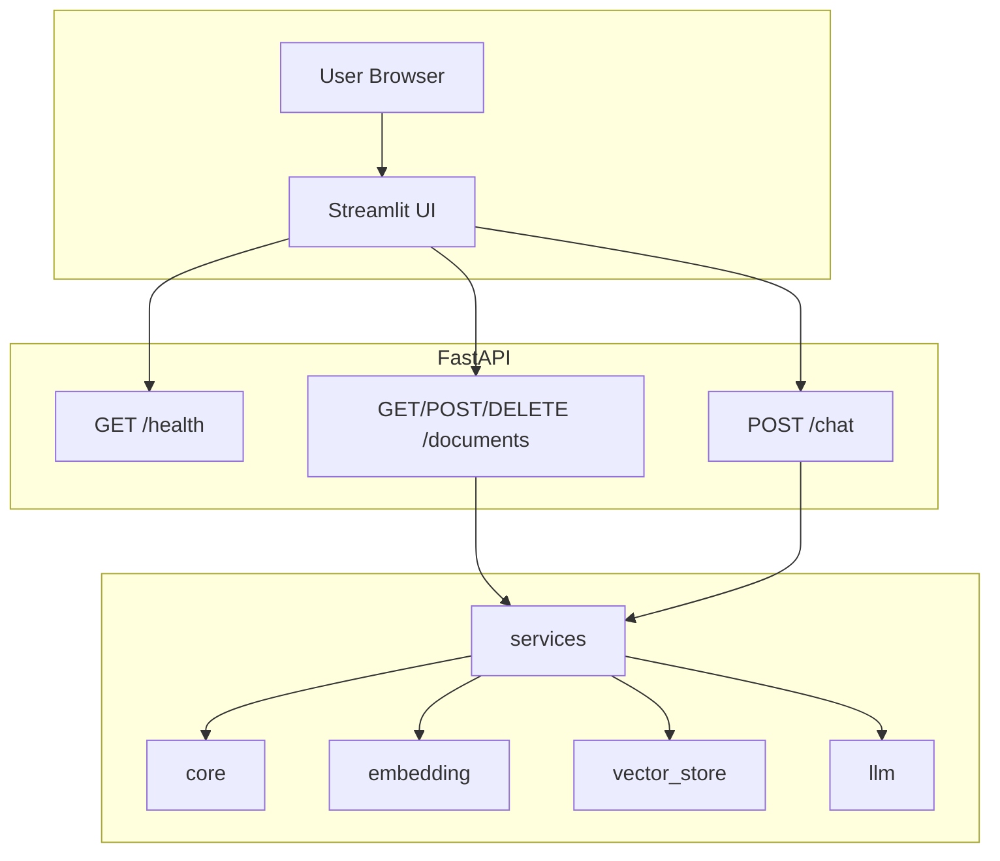

# RAG Document Assistant

> FastAPI (async) backend + Streamlit frontend for a RAG-based **Help Support Assistant**. Upload PDFs, index with FAISS, and chat with answers strictly from the knowledge base.

---

## Table of contents

- [Features](#features)
- [Prerequisites](#prerequisites)
- [Installation](#installation)
- [Configuration](#configuration)
- [Usage](#usage)
- [Project structure](#project-structure)
- [Architecture](#architecture)
- [API reference](#api-reference)
- [📊 RAG Evaluation](#-rag-evaluation)
- [Maintaining this README](#maintaining-this-readme)

---

## Features

- **Document ingestion:** Upload PDFs; text is extracted, chunked, embedded (SentenceTransformer), and stored in a FAISS vector store.
- **RAG chat:** Query is embedded and matched against stored chunks; top-k context is passed to an LLM with a strict **Help Support Assistant** prompt (answer only from knowledge base, redirect otherwise).
- **Async API:** FastAPI with blocking work (embedding, FAISS, LLM) offloaded to a thread pool.
- **Streamlit UI:** Welcome, Chatbot, and Upload Documents pages that call the API.

---

## Prerequisites

- **Python** 3.10+
- **LLM API:** OpenAI-compatible chat completions endpoint (URL + API key). Set in `.env` as `API_URL` and `API_KEY`.

---

## Installation

1. **Clone the repository** and go to the project root.

2. **Create and activate a virtual environment:**
   ```bash
   python -m venv .venv
   .venv\Scripts\activate        # Windows
   # source .venv/bin/activate   # macOS / Linux
   ```

3. **Install dependencies:**
   ```bash
   pip install -r requirements.txt
   ```

4. **Copy `.env.example` to `.env`** and set at least:
   - `API_URL` – your LLM chat completions URL
   - `API_KEY` – API key (sent as `X-API-KEY`)
   - `API_BASE_URL` – backend URL for Streamlit (default: `http://localhost:8000`)

---

## Configuration

| Source | Purpose |
|--------|--------|
| **.env** | `API_URL`, `API_KEY`, `LLM_MODEL`, `API_BASE_URL` |
| **core/config.py** (or env) | `EMBEDDING_MODEL_PATH`, `EMBEDDING_DIMENSION`, `TEXT_CHUNK_SIZE`, `TEXT_CHUNK_OVERLAP`, `FAISS_INDEX_PATH`, `LOG_FILE_PATH` |

---

## Usage

**1. Start the FastAPI backend** (from project root):

```bash
uvicorn api.main:app --reload --host 0.0.0.0 --port 8000
```

**2. Start the Streamlit UI** (from project root):

```bash
streamlit run streamlit_app/Welcome.py
```

Open the URL shown (e.g. `http://localhost:8501`). Use **Upload Documents** to add PDFs and **Chatbot** to ask questions (enable RAG to use the indexed documents as context).

---

## Project structure

```
jam-chatbot/
├── api/                    # FastAPI app & routes
│   ├── main.py
│   └── routes/
│       ├── health.py       # GET /health
│       ├── documents.py    # GET/POST/DELETE /documents
│       └── chat.py         # POST /chat
├── core/                   # Config, logging, text utils
├── embedding/              # SentenceTransformer model & embeddings
├── llm/                    # Custom LLM client (OpenAI-compatible)
├── vector_store/          # FAISS index & metadata
├── services/               # Ingestion & RAG logic
├── streamlit_app/         # Streamlit UI
│   ├── Welcome.py
│   ├── config.py
│   ├── api_client.py
│   └── pages/
├── logs/                   # App logs (created at runtime)
├── data/                   # FAISS index files (created at runtime)
├── uploaded_files/         # Uploaded PDFs (created at runtime)
├── notebooks/              # API test notebooks (optional)
│   ├── 01_documents_api.ipynb
│   ├── 02_chat_api.ipynb
│   └── README.md
├── .env.example
├── requirements.txt
└── README.md
```

---

## Architecture

### RAG pipeline

This project uses a **Naive RAG (Retrieve-then-Read)** pipeline:

- **Indexing:** PDF → extract text → clean & chunk (word-based, overlap) → embed (SentenceTransformer) → store in FAISS.
- **Query:** User question → embed query → k-NN search in FAISS → top-k chunks as context → single prompt (system + context + history + query) → one LLM call → response.

No query rewriting, hybrid search, or reranker; one embedding model and one retrieval step.

### High-level diagram

```
┌─────────────────────────────────────────────────────────────────────────────────┐
│                              USER (Browser)                                       │
└─────────────────────────────────────────────────────────────────────────────────┘
                    │                                    │
                    ▼                                    ▼
┌───────────────────────────────┐        ┌──────────────────────────────────────────┐
│   STREAMLIT UI                │        │   FASTAPI BACKEND (async)                │
│   streamlit_app/               │  HTTP  │   api/                                    │
│   • Welcome, Chatbot, Upload  │◄──────►│   /health, /documents, /chat              │
└───────────────────────────────┘        └──────────────────────────────────────────┘
                                                          │
         ┌────────────────────────────────────────────────┼────────────────────────────────┐
         │                        │                        │                                │
         ▼                        ▼                        ▼                                ▼
┌─────────────────┐    ┌─────────────────┐    ┌─────────────────┐    ┌─────────────────────────┐
│  core/           │    │  embedding/     │    │  vector_store/   │    │  llm/                   │
│  config, logging │    │  SentenceTrans-  │    │  FAISS index +   │    │  CustomLLM (your API)   │
│  text_utils      │    │  former         │    │  metadata        │    │  OpenAI-compatible      │
└─────────────────┘    └─────────────────┘    └─────────────────┘    └─────────────────────────┘
         │                        │                        │                                │
         └────────────────────────┴────────────────────────┴────────────────────────────────┘
                                                          │
                                          ┌───────────────┴───────────────┐
                                          │  services/                     │
                                          │  ingestion | rag               │
                                          └───────────────────────────────┘

  INGEST:  PDF → extract → chunk → embed → FAISS add
  QUERY:   query → embed → FAISS search → prompt → LLM → response
```

**Mermaid** (for viewers that support it):



---

## API reference

Base URL: `http://localhost:8000` (or your `API_BASE_URL`).

### 1. Health check

| Method | Path    | Body | Description |
|--------|---------|------|-------------|
| GET    | /health | -    | Check if API is up |

**Response (200):**
```json
{
  "status": "ok",
  "service": "rag-api"
}
```

---

### 2. List documents

| Method | Path       | Body | Description |
|--------|------------|------|-------------|
| GET    | /documents | -    | List unique document names in the vector store |

**Process:** Ensure FAISS index exists → load metadata → return unique `document_name` values (sorted).

**Response (200):**
```json
{
  "documents": [
    "Bank-Policy-Development-pol-fin(world-Bank).pdf",
    "FAQ.pdf"
  ]
}
```

---

### 3. Upload document

| Method | Path               | Body               | Description |
|--------|--------------------|--------------------|-------------|
| POST   | /documents/upload  | multipart/form-data | Upload PDF: extract text, chunk, embed, index |

**Process:** Validate PDF → read bytes → extract text (PyPDF2) → save file under `uploaded_files/` → ensure index exists and name not duplicate → chunk text → embed (SentenceTransformer, thread pool) → add to FAISS + metadata → return counts.

**Request:** Form field `file` = PDF file.

**Example:**
```bash
curl -X POST "http://localhost:8000/documents/upload" \
  -F "file=@/path/to/document.pdf"
```

**Response (200):**
```json
{
  "filename": "document.pdf",
  "chunks_indexed": 42,
  "errors": []
}
```

**Errors:** 400 (not PDF / no text), 409 (document already exists).

---

### 4. Delete document

| Method | Path                     | Body | Description |
|--------|--------------------------|------|-------------|
| DELETE | /documents/{document_name} | -    | Remove all chunks for this document and delete file from uploads |

**Process:** Load index and metadata → filter out entries with given `document_name` → rebuild index and save → delete file from `uploaded_files/` if present.

**Response (200):**
```json
{
  "deleted": 42
}
```

---

### 5. Chat (RAG)

| Method | Path  | Body | Description |
|--------|-------|------|-------------|
| POST   | /chat | JSON | One support-style reply; optional RAG retrieval |

**Process:** Validate `query` → if `use_rag`: embed query → FAISS k-NN → top-k chunks as context → build prompt (Help Support Assistant system + context + history + query) → call LLM → return response.

**Request body:**

| Field         | Type    | Required | Default | Description        |
|---------------|---------|----------|---------|--------------------|
| query         | string  | Yes      | -       | User question      |
| use_rag       | boolean | No       | true    | Use RAG context    |
| num_results   | int     | No       | 5       | Chunks to retrieve |
| temperature   | number  | No       | 0.7     | LLM temperature    |
| chat_history  | array   | No       | []      | `[{ "role", "content" }]` |

**Request sample:**
```json
{
  "query": "What is the refund policy?",
  "use_rag": true,
  "num_results": 5,
  "temperature": 0.7,
  "chat_history": [
    { "role": "user", "content": "Hi" },
    { "role": "assistant", "content": "Hello! How can I help you today?" }
  ]
}
```

**Response (200):**
```json
{
  "response": "According to the knowledge base, refunds are processed within 5–7 business days after approval."
}
```

**Errors:** 400 if `query` is empty.

---

## 📊 RAG Evaluation

This section documents how to **evaluate** the "Help support assistant" RAG pipeline across **retrieval**, **generation** (faithfulness/hallucinations), **end‑to‑end quality**, and **system** metrics.

### Goals
- Ensure the assistant's answers are **grounded in retrieved context** (high faithfulness, low hallucinations).
- Verify **retrieval quality** (recall@k, MRR, nDCG), **attribution**, and **answer relevance**.
- Track **latency** and **cost**, with reproducible runs and reports.

### 🧩 Components
```
eval/
├── evaluator.py
├── metrics.py
├── judge_prompts/
│   ├── faithfulness.json
│   └── relevance.json
├── datasets/
│   └── eval.jsonl
└── reports/
```
Generation prompt: `prompts/grounded_answer.txt` (enforces grounded answers + inline citations [1], [2]).

### 📦 Installation
```bash
pip install -r requirements.txt
pip install -r requirements-eval.txt
# Or: pip install transformers sentencepiece nltk
python -c "import nltk; nltk.download('punkt')"
# Optional: ragas, trulens-eval
```

### 🏃 One-command run
```bash
# From project root
python -m eval.evaluator --data eval/datasets/eval.jsonl --k 5 --judge nli --out eval/reports/run_YYYYMMDD_HHMM/
python -m eval.evaluator --data eval/datasets/eval.jsonl --k 5 --judge llm --out eval/reports/run_YYYYMMDD_HHMM/
```
Reports are written to the `--out` directory as `report.json`, `report.csv`, `report.md`, and `report.html`.

### Metrics
- **Retrieval:** Recall@k, MRR@k, nDCG@k, Coverage, Redundancy.
- **Generation:** Faithfulness (NLI and/or LLM-as-judge), Hallucination rate, Answer relevance, Attribution (precision & recall), Context utilization, Conciseness.
- **End-to-end:** Exact Match, F1, Nugget F1 (when gold answers/nuggets exist).
- **System:** Latency (p50/p95) per stage, tokens in/out.

### Eval dataset
Populate `eval/datasets/eval.jsonl` with one JSON object per line:
- `query` (required), `ground_truth`, `gold_passages` (list), `nuggets` (list).

---

## Maintaining this README

When you change code, add/remove dependencies, or alter the API, update this README so it stays accurate for future reference.
