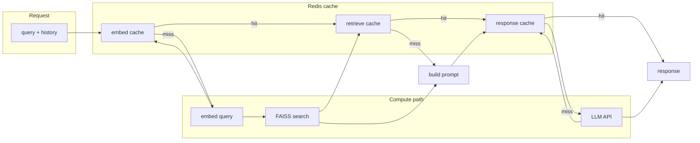

# API test notebooks (direct function calls)

These notebooks test the **actual Python functions** used by the Documents and Chat flows—no HTTP or running API server. Useful for fast local testing.

## Prerequisites

- Dependencies installed: `pip install -r requirements.txt` (from project root).
- For **02_chat_api**: `.env` must have `API_URL` and `API_KEY` for your LLM.
- For **rag_eval_report**: `pip install -r requirements-eval.txt` (from project root) and ensure `eval/datasets/eval.jsonl` exists.

## Notebooks

| File | What it tests |
|------|----------------|
| **01_documents_api.ipynb** | `create_index()`, `list_document_names()`, `process_and_index_document(text, name)`, `delete_documents_by_document_name(name)` |
| **02_chat_api.ipynb** | `chat_response(query, use_rag, num_results, temperature, chat_history)` from `services.rag` |
| **rag_eval_report.ipynb** | RAG evaluation: `run_eval_sync()` from `eval.evaluator`; writes reports to `eval/reports/run_*` |

## How to run

1. Open the notebook from the repo (e.g. from project root: `jupyter notebook notebooks/01_documents_api.ipynb`, or open in VS Code/Cursor).
2. Run the **Setup** cell first so the project root is on `sys.path` and `.env` is loaded.
3. Run the rest of the cells. In **01_documents_api**, set `PDF_PATH` (or the path in the full-flow cell) to a real PDF before running upload/full flow.

No need to start the FastAPI server; Everything runs in-process (including **rag_eval_report.ipynb**).

---

## LLM caching architecture

When **Redis cache** is enabled (`REDIS_URL` + `CACHE_ENABLED=true`), the RAG pipeline uses a three-layer cache to reduce LLM cost, avoid recomputing embeddings, and speed up repeated or identical queries.

```
┌─────────────────────────────────────────────────────────────────────────────────────────┐
│                              CHAT REQUEST (query, history)                               │
└─────────────────────────────────────────────────────────────────────────────────────────┘
                                              │
                                              ▼
                    ┌─────────────────────────────────────────┐
                    │  Build RAG context (if use_rag)         │
                    │  prefix = "passage: {query}" or query   │
                    └─────────────────────────────────────────┘
                                              │
         ┌────────────────────────────────────┼────────────────────────────────────┐
         ▼                                    ▼                                    ▼
┌─────────────────┐                ┌─────────────────┐                ┌─────────────────┐
│  EMBEDDING      │                │  RETRIEVAL      │                │  CONTEXT         │
│  Cache key:     │                │  Cache key:     │                │  Build prompt:   │
│  rag:embed:     │                │  rag:retrieve:   │                │  system +        │
│  {query_hash}   │                │  {query}:{top_k} │                │  [1]...[k] +     │
│                 │                │                 │                │  history + query │
│  Hit → return   │                │  Hit → return   │                └────────┬────────┘
│  vector         │                │  list of chunks │                         │
│  Miss → encode  │                │  Miss → FAISS   │                         │
│  + cache set    │                │  search + set   │                         │
└─────────────────┘                └─────────────────┘                         │
         │                                    │                                │
         └────────────────────────────────────┴────────────────────────────────┘
                                              │
                                              ▼
                    ┌─────────────────────────────────────────┐
                    │  RESPONSE CACHE (only if temperature=0)  │
                    │  Key: rag:response:{hash(prompt)}        │
                    │  Hit → return cached answer              │
                    └─────────────────────────────────────────┘
                                              │
                                    Miss (or temp>0)
                                              │
                                              ▼
                    ┌─────────────────────────────────────────┐
                    │  LLM (OpenAI-compatible API)             │
                    │  → response → cache set (if temp=0)      │
                    └─────────────────────────────────────────┘
                                              │
                                              ▼
┌─────────────────────────────────────────────────────────────────────────────────────────┐
│                              CHAT RESPONSE (answer)                                       │
└─────────────────────────────────────────────────────────────────────────────────────────┘
```

**Mermaid** (for viewers that support it):



See [README_REDIS_CACHE.md](../README_REDIS_CACHE.md) for benefits, local and cloud setup, and configuration.
